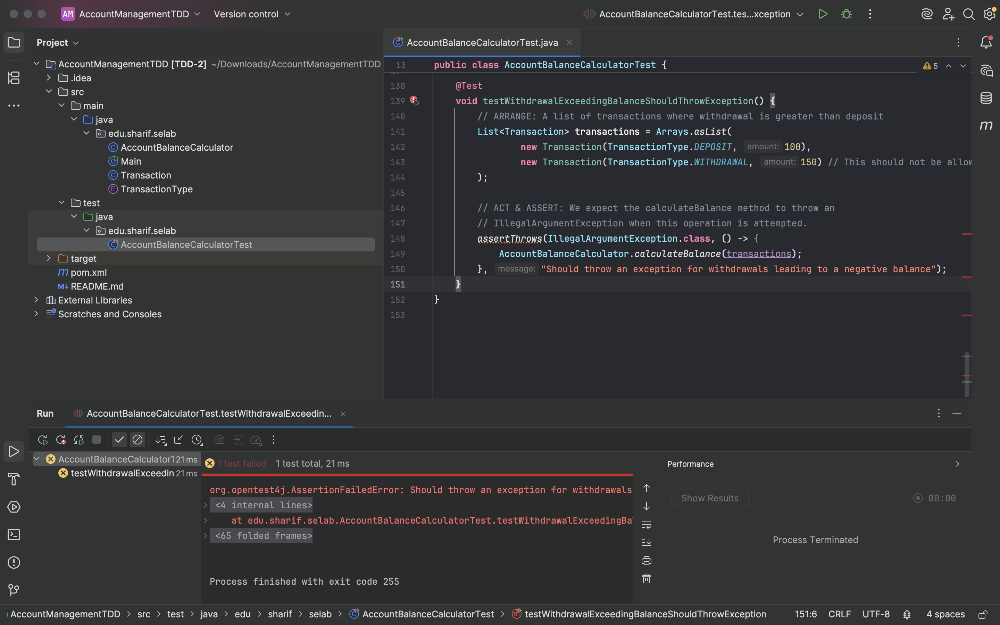
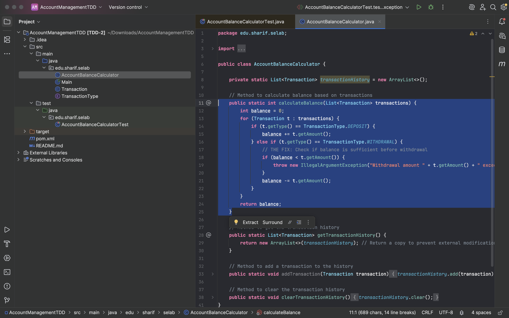
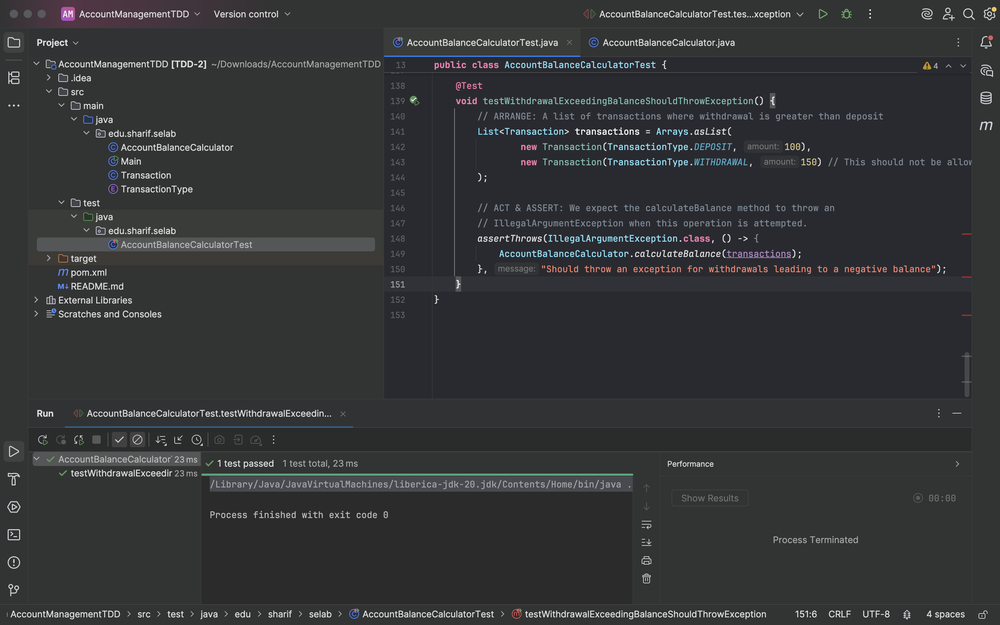

# HW3
Test-Driven Development

## پاسخ به پرسش‌های بخش اول

### پرسش اول
**سوال:** در این که چه خطایی وجود دارد؟ و به نظر شما چرا دیده نشده است؟ (در دو خط توضیح دهید)

**پاسخ:**
خطای موجود این است که متد `calculateBalance` اجازه می‌دهد برداشت از حساب منجر به موجودی منفی شود، که این برخلاف قوانین تعریف‌شده‌ی برنامه است.  
این خطا در تست‌های اولیه دیده نشده بود زیرا هیچ‌کدام از موارد آزمون (Test Cases) سناریویی را پوشش نمی‌دادند که در آن مبلغ برداشت از موجودی فعلی حساب بیشتر باشد.

### پرسش دوم

**وظیفه:** پس از یافتن خطا، یک آزمون برای آن بنویسید که منجر به کشف آن خطا شود. سپس آن را به گونه ای اصلاح کنید که آن مورد آزمون پاس شود.

**گزارش انجام کار:**

مطابق با دستورالعمل، ابتدا یک تست جدید به نام `testWithdrawalExceedingBalanceShouldThrowException` نوشته شد تا خطای مربوط به امکان منفی شدن موجودی را شناسایی کند. این فرآیند طبق چرخه‌ی TDD انجام شد.

**1. نتیجه اجرای تست پیش از اعمال تغییرات (حالت قرمز - RED):**

در این مرحله، تست نوشته‌شده برای باگ اجرا گردید. همانطور که مشاهده می‌شود، تست با شکست مواجه شد زیرا کد اصلی، خطای مورد انتظار (`IllegalArgumentException`) را در زمان برداشت غیرمجاز پرتاب نمی‌کند.

**2. تغییرات اعمال‌شده در کد اصلی:**

برای رفع این مشکل و پاس شدن تست، یک شرط به متد `calculateBalance` اضافه شد تا پیش از هر عملیات برداشت، کافی بودن موجودی را بررسی کند و در صورت عدم موجودی کافی، یک خطا پرتاب نماید.

**3. نتیجه اجرای تست پس از اعمال تغییرات (حالت سبز - GREEN):**

پس از اعمال تغییرات در کد، همان تست مجدداً اجرا شد و این بار با موفقیت پاس گردید. این نشان می‌دهد که باگ با موفقیت برطرف شده و عملکرد برنامه مطابق با نیازمندی‌ها است.

### پرسش سوم
**سوال:** بنظر شما و بر اساس تجربه ی بدست آمده نوشتن آزمون پس از نوشتن برنامه چه مشکلاتی را میتواند بسازد؟ (در سه خط توضیح دهید)

**پاسخ:**
نوشتن آزمون پس از تکمیل کد، این ریسک را ایجاد می‌کند که تست‌ها تنها مسیرهای موفق (Happy Paths) را پوشش دهند و موارد مرزی و خطاها (مانند باگ موجودی منفی) نادیده گرفته شوند، زیرا توسعه‌دهنده به صورت ناخودآگاه تمایل به تأیید کدی دارد که نوشته است.

همچنین، کدی که بدون در نظر گرفتن آزمون‌پذیری نوشته می‌شود، ممکن است به گونه‌ای طراحی شود که تست کردن آن در آینده دشوار یا غیرممکن باشد و نیازمند بازنویسی (Refactoring) گسترده گردد.

در نهایت، این رویکرد می‌تواند منجر به پوشش آزمون (Test Coverage) پایین و ناقص شود، زیرا ممکن است توسعه‌دهنده فراموش کند برای تمام منطق‌ها و قابلیت‌های پیاده‌سازی‌شده، تست کافی بنویسد.

## پاسخ پرسش‌های بخش دوم

تست‌ها را به ترتیب بررسی می‌کنیم. تست‌های اول و دوم با فراخوانی <code>addTransaction(t)</code> در متد <code>calculateBalance</code> پاس می‌شوند.
تست سوم حذف شدن تاریخچه‌ی محاسبات قبلی را بررسی می‌کند که با فراخوانی <code>clearTransactionHistory</code> قبل از انجام محاسبات در همان متد پاس می‌شود.

